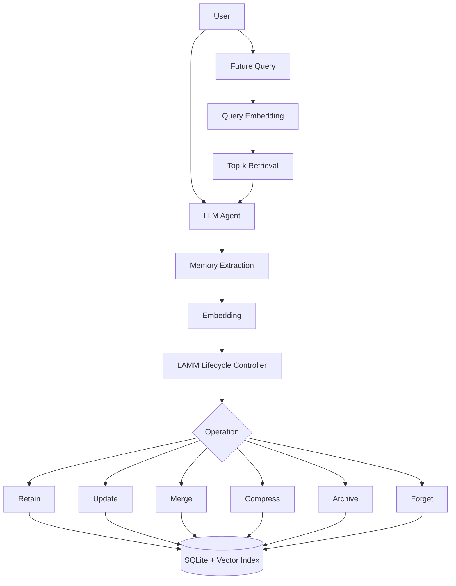

# LAMM: Lightweight Adaptive Memory Management for Long-Term LLM Agents

LAMM is a runnable B.Tech mini-project research prototype for managing long-term memories in LLM agents. It treats memory as a lifecycle instead of an append-only store, using transparent scores and configurable thresholds to decide whether a candidate memory should be retained, updated, merged, compressed, archived, or forgotten.

The project is training-free. The lifecycle controller is implemented in Python and remains independent from the underlying LLM. Gemini can be used when `GEMINI_API_KEY` is configured, but the demo, tests, and evaluation run offline in deterministic mock mode.

## Problem Statement

Long-term LLM agents need persistent memory for coherent personalized conversations. Storing every extracted fact causes redundant memories, stale information, larger prompts, increasing retrieval overhead, higher latency, and unnecessary token consumption.

## Aim

Build an external, configurable, explainable memory-management layer for long-term LLM agents that can reduce unnecessary memory growth while preserving relevant information.

## Research Questions

1. How can a training-free controller decide memory lifecycle operations using transparent scoring?
2. How does adaptive lifecycle management compare with unmanaged persistent memory?
3. What memory, retrieval, context-size, and latency metrics can be measured reproducibly in a student research prototype?

## Objectives

- Implement persistent memory storage using SQLite.
- Implement semantic retrieval using FAISS when available, with a deterministic NumPy fallback.
- Implement lifecycle operations: retain, update, merge, compress, archive, and forget.
- Provide offline deterministic mode for tests and review demos.
- Provide Gemini integration without hard-coded secrets.
- Provide an unmanaged baseline for fair comparison.
- Generate reproducible results, figures, and reports.

## Proposed Architecture



## Technology Stack

- Python 3.11+
- FastAPI
- Pydantic
- Google Gemini API, optional
- sentence-transformers, optional configurable embeddings
- FAISS via `faiss-cpu`, with NumPy fallback for portability
- SQLite
- NumPy, Pandas, Matplotlib
- Streamlit
- pytest

## Memory Lifecycle

- `RETAIN`: store useful non-redundant memory.
- `UPDATE`: revise an existing memory when new information supersedes it.
- `MERGE`: consolidate highly redundant memories.
- `COMPRESS`: shorten verbose memories while preserving facts.
- `ARCHIVE`: remove low-priority memories from normal active retrieval.
- `FORGET`: mark obsolete or low-value memories as forgotten and remove them from active retrieval.

Every decision is recorded in `lifecycle_events` with scores and a human-readable explanation.

## Scoring Methodology

```text
score = relevance*w_relevance
      + recency*w_recency
      + confidence*w_confidence
      + utility*w_utility
      - redundancy*w_redundancy
```

Scores are normalized to `[0, 1]`. Initial values are engineering parameters to tune experimentally, not scientifically validated constants.

## Baseline

`UNMANAGED_MEMORY` extracts and stores memories without adaptive lifecycle operations while using the same embedding and retrieval machinery.

## Evaluation Methodology

The evaluation runner supports JSON-style datasets and includes `data/evaluation/synthetic_demo.json`, clearly labeled as synthetic demo data. It measures memory counts, lifecycle operation counts, retrieval latency, approximate context size, and precision@k when expected memory IDs are available.

No benchmark superiority is claimed unless generated results support it.

## Project Structure

```text
app/                 FastAPI app, agent, memory, retrieval, storage, evaluation
dashboard/           Streamlit dashboard
docs/                Architecture, algorithm, evaluation notes
scripts/             DB initialization, index rebuild, demo, evaluation
tests/               pytest suite
data/evaluation/     Synthetic demo dataset
results/             Generated figures, tables, reports
```

## Installation

```bash
python -m venv .venv
.venv\Scripts\activate
pip install -r requirements.txt
```

## Environment Setup

Copy `.env.example` to `.env` and edit values as needed. Never commit `.env`.

## Configure Gemini

Set `GEMINI_API_KEY` and optionally `GEMINI_MODEL`. If the key is missing, LAMM runs in deterministic mock mode.

## Running

```bash
python scripts/run_demo.py
uvicorn app.main:app --reload
streamlit run dashboard/streamlit_app.py
pytest
python scripts/run_evaluation.py
```

OpenAPI docs are available at `http://127.0.0.1:8000/docs`.

## API Endpoints

- `POST /chat`
- `POST /memory`
- `GET /memory/{id}`
- `GET /memories`
- `DELETE /memory/{id}`
- `POST /memory/rebuild-index`
- `GET /memory/stats`
- `GET /lifecycle/events`
- `POST /evaluation/run`
- `GET /evaluation/results`

## Results Location

- `results/tables/`
- `results/figures/`
- `results/reports/`

## Privacy And Data Handling

Memories and embeddings are stored locally. No API keys are hard-coded. Gemini receives only the prompt/context needed for a call when enabled. Offline mode avoids external LLM calls.

## Limitations

- The default extraction rules are deterministic and simple for reproducible demos.
- FAISS deletion is handled by rebuilding the active index.
- Synthetic demo data is not a real benchmark.
- Initial weights and thresholds are engineering assumptions.

## Future Work

- Add stronger contradiction/update detection.
- Evaluate on a larger public long-term dialogue benchmark.
- Add human-rated conversational quality evaluation.
- Add model-specific token counting.
- Add a production vector database adapter.
