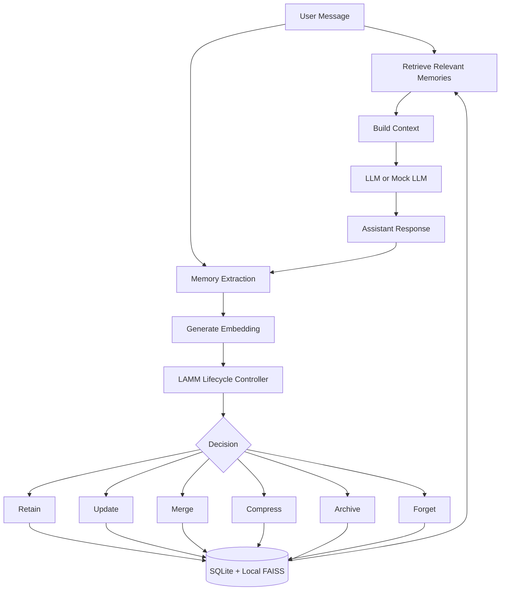

# LAMM: Lightweight Adaptive Memory Management for Long-Term LLM Agents

LAMM is a runnable B.Tech mini-project research prototype for long-term memory management in LLM-based agents. It implements an external memory-management layer that decides what should happen to newly extracted memories instead of blindly storing every fact forever.

The core idea is to treat memory as a lifecycle:

```text
RETAIN -> UPDATE -> MERGE -> COMPRESS -> ARCHIVE -> FORGET
```

The implementation is training-free, explainable, and locally runnable. Gemini is optional. The system can run fully offline using deterministic extraction, mock LLM responses, SQLite, and a local FAISS vector index.

## Current Implementation Status

Implemented:

- FastAPI backend.
- Streamlit dashboard.
- Gemini adapter using API key from `.env`.
- Offline deterministic mock mode.
- SQLite memory metadata database.
- Local FAISS vector index for semantic retrieval.
- NumPy fallback behavior for vector search if needed.
- Memory extraction component.
- Weighted memory scoring.
- Recency, confidence, redundancy, utility, and relevance signals.
- Lifecycle controller for `RETAIN`, `UPDATE`, `MERGE`, `COMPRESS`, `ARCHIVE`, and `FORGET`.
- Lifecycle event logging.
- Unmanaged memory baseline.
- Synthetic demo dataset.
- Evaluation runner.
- CSV, JSON, Markdown, and PNG result artifacts.
- Unit tests and end-to-end mock pipeline test.

Not claimed:

- This project does not claim LAMM is scientifically superior before proper experiments.
- The included synthetic dataset is demo data, not a benchmark.
- Default weights and thresholds are engineering assumptions, not validated constants.

## Problem Statement

Long-term LLM agents need persistent memory to support coherent, personalized conversations. However, storing every extracted fact creates several problems:

- redundant memories
- outdated memories
- irrelevant memories
- low-confidence memories
- increasing storage size
- increasing retrieval overhead
- larger LLM prompts
- higher latency
- higher token consumption
- higher inference cost

LAMM addresses this by applying explicit memory lifecycle decisions before memory growth becomes unmanaged.

## Aim

To design and implement a lightweight, explainable, training-free memory-management layer for long-term LLM agents that can dynamically manage memory growth while preserving useful conversational information.

## Research Questions

1. Can a training-free lifecycle controller manage long-term memories using transparent scoring?
2. How does adaptive memory management compare with unmanaged persistent memory?
3. Can lifecycle decisions reduce unnecessary memory growth while preserving relevant retrieval?
4. What metrics can be measured reproducibly in a student research prototype?

## Objectives

- Store long-term memories persistently.
- Retrieve relevant memories using vector similarity.
- Score memories using interpretable signals.
- Detect redundant or update-like memories.
- Apply lifecycle operations in a transparent way.
- Keep Gemini optional, not mandatory.
- Provide an offline demo mode for review panels.
- Compare LAMM against an unmanaged memory baseline.
- Save evaluation outputs for reports and presentations.

## Architecture Overview



## Important Design Principle

LAMM is independent from the underlying LLM.

Gemini is used only for LLM behavior when configured. The memory lifecycle controller is implemented in Python and does not hide its logic inside prompts.

The Python controller handles:

- scoring
- duplicate detection
- lifecycle decisions
- metadata updates
- vector index updates
- event logging
- retrieval integration

## Do We Need A Vector DB URL?

No. This project does not require a cloud vector database URL.

The current implementation stores vectors locally and offline:

- Memory text and metadata are stored in SQLite.
- Embeddings are stored in a local FAISS index.
- A mapping file connects vector index entries to SQLite memory IDs.

This is intentional. For a B.Tech mini-project prototype, local FAISS is:

- easier to run
- cheaper
- private
- offline-compatible
- good for demonstrations
- scientifically acceptable for a retrieval prototype

A cloud vector database such as Pinecone, Qdrant Cloud, Weaviate, or Milvus can be added later by implementing another `VectorStore` adapter.

## Storage Design

SQLite is the source of truth.

Stored in SQLite:

- memory ID
- memory text
- timestamps
- lifecycle status
- confidence score
- relevance score
- recency score
- redundancy score
- utility score
- source
- conversation ID
- archive status
- compressed text
- parent memory ID
- metadata
- lifecycle events

Stored in FAISS/local vector files:

- normalized embedding vectors
- vector-to-memory mapping

FAISS is not treated as the metadata database. It is only the retrieval index.

## Technology Stack

Core:

- Python 3.11+
- FastAPI
- Pydantic
- SQLite
- FAISS
- NumPy
- Pandas
- Matplotlib
- pytest

LLM:

- Google Gemini API through `.env`
- deterministic mock LLM when Gemini is unavailable or disabled

Embeddings:

- deterministic hash embeddings by default
- optional `sentence-transformers` support via `requirements-ml.txt`

UI:

- Streamlit

## Project Structure

```text
LAMM/
├── README.md
├── LICENSE
├── .env.example
├── .gitignore
├── requirements.txt
├── requirements-ml.txt
├── pyproject.toml
├── app/
├── dashboard/
├── data/
├── docs/
├── scripts/
├── tests/
└── results/
```

Important directories:

- `app/`: backend, agent pipeline, memory lifecycle logic, retrieval, storage, evaluation.
- `dashboard/`: Streamlit research dashboard.
- `docs/`: architecture, algorithm, and evaluation notes.
- `scripts/`: command-line demo, evaluation, Gemini smoke test, DB/index utilities.
- `tests/`: pytest coverage.
- `data/evaluation/`: synthetic demo dataset.
- `results/`: generated tables, reports, and figures.

## Main Modules

### `app/memory/schemas.py`

Defines memory-related Pydantic models:

- `CandidateMemory`
- `MemoryRecord`
- `LifecycleDecision`
- `ScoreBundle`
- `RetrievedMemory`
- lifecycle status enums
- lifecycle operation enums

### `app/memory/extraction.py`

Extracts memory candidates from conversations.

Modes:

- deterministic rule-based extraction for offline demos and tests
- Gemini-based extraction when enabled

LLM output is validated with Pydantic before use.

### `app/memory/scoring.py`

Implements interpretable scoring:

```text
score = relevance*w_relevance
      + recency*w_recency
      + confidence*w_confidence
      + utility*w_utility
      - redundancy*w_redundancy
```

Also includes exponential recency decay.

### `app/memory/lifecycle.py`

Contains the central LAMM lifecycle controller.

It decides:

- `RETAIN`
- `UPDATE`
- `MERGE`
- `COMPRESS`
- `ARCHIVE`
- `FORGET`

Every decision includes a reason and score bundle.

### `app/memory/manager.py`

Coordinates:

- extraction
- embedding
- retrieval
- lifecycle decisions
- SQLite updates
- FAISS updates
- event logging

### `app/retrieval/faiss_store.py`

Implements local vector retrieval using FAISS with normalized inner product. It persists:

- FAISS index
- NumPy fallback vectors
- mapping from vector entries to memory IDs

### `app/storage/database.py`

Creates SQLite tables:

- `conversations`
- `memories`
- `lifecycle_events`

### `app/agent/agent.py`

Runs the end-to-end agent pipeline:

1. receive user message
2. retrieve relevant memories
3. build prompt context
4. generate response
5. extract candidate memories
6. score and decide lifecycle action
7. persist updates
8. return response, retrieved memories, extracted memories, decisions, and stats

## Memory Lifecycle Operations

### RETAIN

Stores a useful new memory as active.

Example:

```text
User prefers Python for backend development.
```

### UPDATE

Updates an existing memory when new information modifies it.

Example:

```text
Old: User prefers Python for backend development.
New: User has started using Java for current backend project.
```

### MERGE

Combines redundant memories.

Example:

```text
Memory 1: User prefers Python for backend development.
Memory 2: Python is the user's preferred backend language.
```

### COMPRESS

Shortens verbose memories while preserving meaning.

### ARCHIVE

Stores low-priority or low-confidence memories outside normal active retrieval.

### FORGET

Marks a memory as forgotten and removes it from active retrieval. The vector index is rebuilt when needed to avoid stale retrieval mappings.

## Configuration

Create `.env` from `.env.example`.

```text
GEMINI_API_KEY=
GEMINI_MODEL=gemini-flash-latest
EMBEDDING_MODEL=hash
DATABASE_URL=sqlite:///storage/lamm.db
FAISS_INDEX_PATH=storage/vector_index
TOP_K=5
RELEVANCE_WEIGHT=0.30
RECENCY_WEIGHT=0.15
CONFIDENCE_WEIGHT=0.20
REDUNDANCY_WEIGHT=0.25
UTILITY_WEIGHT=0.10
REDUNDANCY_THRESHOLD=0.86
ARCHIVE_THRESHOLD=0.32
FORGET_THRESHOLD=0.18
RECENCY_DECAY=0.03
COMPRESS_LENGTH=180
MAX_ACTIVE_MEMORIES=100
```

Do not commit `.env`.

## Installation

Using your virtual environment:

```powershell
.\lammenv\Scripts\activate
pip install -r requirements.txt
```

Optional transformer embedding support:

```powershell
pip install -r requirements-ml.txt
```

The default `EMBEDDING_MODEL=hash` works offline and does not require downloading transformer models.

## Gemini Setup

Put your key in `.env`:

```text
GEMINI_API_KEY=your_key_here
GEMINI_MODEL=gemini-flash-latest
```

Verify Gemini:

```powershell
.\lammenv\Scripts\python.exe scripts\run_gemini_smoke.py
```

Expected output:

```text
LAMM Gemini smoke test passed
```

If a configured Gemini model is unavailable, the adapter tries to select another available `generateContent` model.

## Running Offline Demo

```powershell
.\lammenv\Scripts\python.exe scripts\run_demo.py
```

This demo is deterministic and intentionally shows:

- retain
- merge
- update
- archive
- compress
- forget
- future query retrieval

Final query:

```text
What programming language am I currently using for my backend project?
```

Expected answer:

```text
You are currently using Java for your backend project.
```

## Running Gemini Demo

The demo defaults to offline mode for reproducibility. To allow Gemini:

```powershell
$env:USE_GEMINI="1"
.\lammenv\Scripts\python.exe scripts\run_demo.py
```

## Running The API

```powershell
.\lammenv\Scripts\uvicorn.exe app.main:app --reload
```

Open:

```text
http://127.0.0.1:8000/docs
```

API endpoints:

- `POST /chat`
- `POST /memory`
- `GET /memory/{id}`
- `GET /memories`
- `DELETE /memory/{id}`
- `POST /memory/rebuild-index`
- `GET /memory/stats`
- `GET /lifecycle/events`
- `POST /evaluation/run`
- `GET /evaluation/results`

## Running Streamlit Dashboard

```powershell
.\lammenv\Scripts\streamlit.exe run dashboard\streamlit_app.py
```

Dashboard pages:

- Chat
- Memory
- Analytics
- Comparison

## Running Tests

```powershell
.\lammenv\Scripts\python.exe -m pytest
```

Tests are designed to run offline and should not require Gemini.

Covered areas:

- scoring
- lifecycle decisions
- deduplication/update detection
- FAISS retrieval
- SQLite persistence
- unmanaged baseline
- end-to-end mock pipeline

## Running Evaluation

```powershell
.\lammenv\Scripts\python.exe scripts\run_evaluation.py
```

Outputs:

```text
results/tables/memory_growth.csv
results/tables/retrieval.csv
results/reports/evaluation_report.json
results/reports/evaluation_report.md
results/figures/memory_growth.png
results/figures/lifecycle_operations.png
```

The evaluation uses synthetic demo data. Do not present it as benchmark proof.

## Baseline

The baseline is `UNMANAGED_MEMORY`.

It:

- extracts candidate memories
- stores all extracted memories
- does not apply adaptive lifecycle management
- uses the same retrieval mechanism

Purpose:

```text
Compare unmanaged persistent memory vs adaptive lifecycle memory management.
```

## Synthetic Demo Dataset

Located at:

```text
data/evaluation/synthetic_demo.json
```

It includes:

- repeated facts
- updated facts
- low-confidence facts
- verbose memory
- temporary/forgettable information
- future query

It is labeled synthetic and should be used only for development/demo.

## Result Interpretation

Generated result files are measured outputs from local runs.

They should be described as:

```text
Measured on the included synthetic demo scenario.
```

They should not be described as:

```text
Proof that LAMM outperforms all existing memory systems.
```

## Privacy Notes

- `.env` is ignored by Git.
- API keys are never hard-coded.
- Local SQLite and FAISS files are used.
- Offline mode sends nothing to Gemini.
- Gemini mode sends prompt/context to Gemini for generation or extraction.
- Do not place real sensitive personal data in demo datasets.

## Known Limitations

- Deterministic extraction is rule-based and simple.
- Update detection is heuristic.
- Merge/compression fallback is simple text processing.
- Synthetic data is not a real benchmark.
- Default thresholds are engineering assumptions.
- The current Gemini package works but warns that Google recommends migrating from `google.generativeai` to `google.genai` in the future.
- FAISS deletion is handled through active-ID filtering and rebuilds.

## Future Work

- Add a production vector database adapter.
- Add stronger contradiction and temporal update detection.
- Add better Gemini JSON extraction prompts.
- Add human-rated conversational quality metrics.
- Add support for LOCOMO/MSC-style benchmark evaluation.
- Add token counting with model-specific tokenizers.
- Add exportable review-panel report generation.
- Migrate Gemini adapter to the newer `google.genai` SDK.

## Quick Command Reference

```powershell
.\lammenv\Scripts\activate
pip install -r requirements.txt
pip install -r requirements-ml.txt
.\lammenv\Scripts\python.exe scripts\run_gemini_smoke.py
.\lammenv\Scripts\python.exe scripts\run_demo.py
.\lammenv\Scripts\python.exe -m pytest
.\lammenv\Scripts\python.exe scripts\run_evaluation.py
.\lammenv\Scripts\uvicorn.exe app.main:app --reload
.\lammenv\Scripts\streamlit.exe run dashboard\streamlit_app.py
```

## Final Note

LAMM is a research prototype. Its goal is to demonstrate a clear, explainable, reproducible approach to adaptive long-term memory management for LLM agents. It is intentionally built so that the system can be demonstrated offline, tested without external APIs, and extended later with stronger models, datasets, or vector databases.
