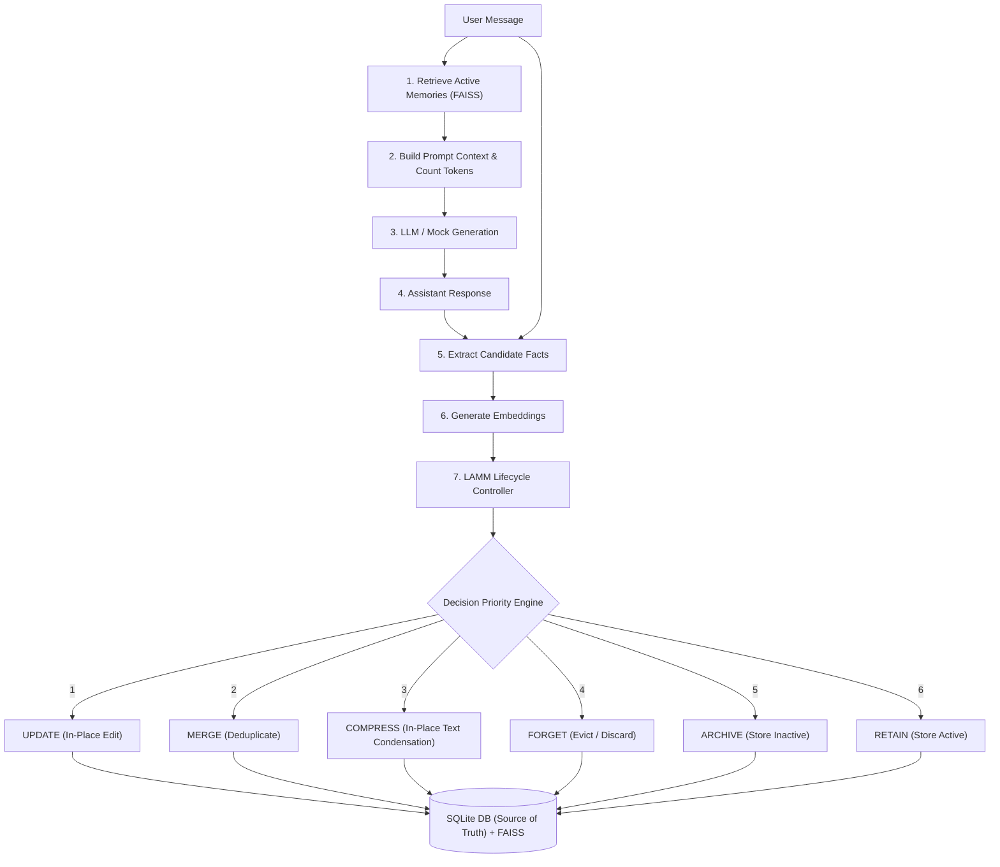

# LAMM: Lightweight Adaptive Memory Management for Long-Term LLM Agents

[](https://www.python.org/)
[](https://fastapi.tiangolo.com/)
[](https://streamlit.io/)
[](https://github.com/facebookresearch/faiss)
[]()

LAMM is a complete, runnable research prototype for long-term memory management in Large Language Model (LLM) agents. Built as a B.Tech mini-project in AI/ML, it introduces an external, training-free memory lifecycle layer that dynamically decides whether incoming knowledge should be retained, updated, merged, compressed, archived, or forgotten—preventing unbounded memory growth, prompt token bloat, and contradictory context.

---

## 1. Key Concepts: Lifecycle Operations vs. Decision Priority

LAMM makes an explicit architectural distinction between the **lifecycle vocabulary** and the **decision priority engine**:

* **Lifecycle Operations (Conceptual Progression):**
  $$\text{Retain} \longrightarrow \text{Update} \longrightarrow \text{Merge} \longrightarrow \text{Compress} \longrightarrow \text{Archive} \longrightarrow \text{Forget}$$
* **Decision Priority Engine (Execution Order):**
  $$\text{Update} \longrightarrow \text{Merge} \longrightarrow \text{Compress} \longrightarrow \text{Forget} \longrightarrow \text{Archive} \longrightarrow \text{Retain}$$

> **Architectural Invariant:** Relational decisions (modifications and deduplications) are always evaluated before score-based eviction. This ensures an incoming knowledge update is never mistakenly dropped due to a lower score.

---

## 2. Current Implementation Status

- [x] **Core Lifecycle Engine:** 6 explicit lifecycle operations with explainable natural-language decision logs.
- [x] **Weighted Scoring:** Transparent 5-factor scoring (Relevance, Recency, Confidence, Redundancy, Utility).
- [x] **Evidence-Based Update Detection:** Regex and semantic indicators detect modifications and contradictions.
- [x] **Dual Storage Subsystem:** SQLite as canonical source of truth; local FAISS vector store for top-$k$ similarity search.
- [x] **LLM Independence & Offline Mode:** 100% runnable offline with deterministic mock LLM; optional Gemini API integration via `.env`.
- [x] **3-Way Fair Comparative Evaluation:** Benchmarked against `UNMANAGED_MEMORY` (no eviction) and `RECENCY_ONLY` (fixed LRU budget).
- [x] **Rich Evaluation Artifacts:** Automated generation of 6 Matplotlib figures, 3 CSV tables, JSON metrics, and academic Markdown reports.
- [x] **FastAPI Backend:** 11 RESTful endpoints including semantic search, dry-run simulation, and privacy deletion.
- [x] **Streamlit Dashboard:** 4-page UI for live chat, memory database inspection, analytics, and 3-way evaluation comparisons.
- [x] **VS Code Integration:** Pre-configured `.vscode/launch.json` and `.vscode/settings.json` for one-click debugging.
- [x] **Comprehensive Test Suite:** 32 passing unit and integration tests across 9 test modules.

---

## 3. Problem Statement & Research Questions

### Problem Statement
Persistent LLM agents face severe degradation when retaining all conversational history unconditionally:
1. **Unbounded Storage Growth:** Memory size increases linearly with turns.
2. **Context Bloat & Cost:** Retrieving redundant facts inflates prompt token consumption and inference latency.
3. **Knowledge Conflicts:** Outdated facts (e.g., old preferences) contradict newer updates, causing agent hallucinations.

### Research Questions
1. *Can an external, training-free lifecycle controller regulate memory growth using interpretable heuristic scoring?*
2. *Does evidence-based update detection resolve knowledge contradictions better than standard persistence?*
3. *How much memory footprint and prompt token reduction can be achieved compared to unmanaged persistence and fixed-budget LRU baselines?*

---

## 4. Architecture Overview


```mermaid
flowchart TD
    U["User Message"] --> RET["1. Retrieve Active Memories (FAISS)"]
    RET --> CB["2. Build Prompt Context & Count Tokens"]
    CB --> LLM["3. LLM / Mock Generation"]
    LLM --> RESP["4. Assistant Response"]
    RESP --> EXT["5. Extract Candidate Facts"]
    U --> EXT
    EXT --> EMB["6. Generate Embeddings"]
    EMB --> LC["7. LAMM Lifecycle Controller"]
    
    LC --> DEC{"Decision Priority Engine"}
    DEC -- "1" --> OP_UPD["UPDATE (In-Place Edit)"]
    DEC -- "2" --> OP_MRG["MERGE (Deduplicate)"]
    DEC -- "3" --> OP_CMP["COMPRESS (In-Place Text Condensation)"]
    DEC -- "4" --> OP_FGT["FORGET (Evict / Discard)"]
    DEC -- "5" --> OP_ARC["ARCHIVE (Store Inactive)"]
    DEC -- "6" --> OP_RET["RETAIN (Store Active)"]
    
    OP_UPD --> DB[("SQLite DB (Source of Truth) + FAISS")]
    OP_MRG --> DB
    OP_CMP --> DB
    OP_FGT --> DB
    OP_ARC --> DB
    OP_RET --> DB
```

---

## 5. Storage Design: SQLite as Source of Truth

LAMM does **not** require any cloud vector database subscriptions. It runs completely locally:
- **SQLite (`storage/lamm.db`):** Stores memory text, active status, creation/update timestamps, access counts, full 5-signal scores, and immutable lifecycle decision audit trails.
- **FAISS (`storage/vector_index.faiss`):** Stores normalized dense embedding vectors of **only active** memories for fast cosine similarity lookup.
- **Synchronization:** When memories are compressed, their vector is updated in-place; when archived or forgotten, their vector is immediately removed from the FAISS active retrieval pool.

---

## 6. Technology Stack

- **Core:** Python 3.12, FastAPI, Pydantic v2, SQLite3, FAISS-CPU, NumPy, Pandas, Matplotlib, PyYAML, Pytest
- **LLM Engine:** Deterministic Mock LLM (default / offline) or Google Gemini API (`google-generativeai`)
- **Embeddings:** Deterministic hash embeddings (384-d, zero dependencies) or Sentence-Transformers (`all-MiniLM-L6-v2`)
- **User Interface:** Streamlit (4-page research dashboard)

---

## 7. Project Structure

```text
LAMM/
├── .env.example                  # Environment configuration template
├── .gitignore                    # Git exclusion rules for DBs, figures, and caches
├── README.md                     # Main project documentation
├── pyproject.toml                # Project metadata
├── requirements.txt              # Production dependencies
├── requirements-ml.txt           # Optional ML dependencies (sentence-transformers)
├── .vscode/                      # VS Code integration
│   ├── launch.json               # 5 pre-configured F5 debug/run tasks
│   └── settings.json             # Python interpreter and pytest configuration
├── app/                          # Main application package
│   ├── main.py                   # FastAPI application entrypoint
│   ├── agent/                    # Conversational agent, prompt builder, LLM adapters
│   ├── api/                      # 11 RESTful endpoints (chat, memory, evaluation)
│   ├── core/                     # Configuration system, YAML loader, logging
│   ├── embeddings/               # Deterministic hash & SentenceTransformer providers
│   ├── evaluation/               # 3-way evaluation harness, LRU baseline, metrics, report
│   ├── memory/                   # Controller, scoring, deduplication, compression, manager
│   ├── retrieval/                # FAISS vector store with remove/rebuild capabilities
│   └── storage/                  # SQLite schema, migrations, and repositories
├── configs/                      # Modular YAML configurations
│   ├── default.yaml              # Default weights, thresholds, and dimensions
│   ├── demo.yaml                 # Configuration for deterministic demonstration
│   └── evaluation.yaml           # Configuration for 3-way evaluation harness
├── dashboard/                    # Interactive UI
│   └── streamlit_app.py          # 4-page Streamlit research dashboard
├── data/evaluation/              # Synthetic evaluation scenarios
│   └── synthetic_demo.json       # 9-turn annotated scenario with ground-truth queries
├── docs/                         # In-depth architectural and mathematical docs
│   ├── architecture.md           # Subsystems, data flow, and design principles
│   ├── lamm_algorithm.md         # Mathematical formulation and decision tree
│   ├── evaluation.md             # Two-level evaluation framework & metric definitions
│   └── vscode_setup.md           # Step-by-step VS Code & virtual environment guide
├── results/                      # Evaluation experiment outputs (generated)
│   ├── figures/                  # 6 Matplotlib PNG charts
│   ├── reports/                  # Markdown & JSON evaluation reports
│   └── tables/                   # CSV performance tables
├── scripts/                      # Runnable automation scripts
│   ├── run_demo.py               # 9-turn deterministic CLI demonstration
│   ├── run_evaluation.py         # 3-way evaluation execution runner
│   └── run_gemini_smoke.py       # Gemini API validation test
└── tests/                        # 32 passing unit and integration tests
```

---

## 8. Quick Start (Using `lammenv`)

> **Full VS Code Guide:** See [docs/vscode_setup.md](docs/vscode_setup.md) for detailed instructions on selecting the interpreter, running with F5, and debugging.

### 1. Run the Deterministic 9-Turn Demo
```powershell
.\lammenv\Scripts\python.exe scripts\run_demo.py
```

### 2. Run the 3-Way Comparative Evaluation
```powershell
.\lammenv\Scripts\python.exe scripts\run_evaluation.py
```
*Outputs generated in `results/figures/`, `results/tables/`, and `results/reports/`.*

### 3. Run the Unit Test Suite
```powershell
.\lammenv\Scripts\python.exe -m pytest
```

### 4. Launch the FastAPI Server
```powershell
.\lammenv\Scripts\uvicorn.exe app.main:app --reload
```
*Interactive Swagger docs available at [http://127.0.0.1:8000/docs](http://127.0.0.1:8000/docs).*

### 5. Launch the Streamlit Research Dashboard
```powershell
.\lammenv\Scripts\streamlit.exe run dashboard\streamlit_app.py
```
*Dashboard available at [http://localhost:8501](http://localhost:8501).*

---

## 9. Configuration & Environment Variables

LAMM supports layered configuration via `configs/default.yaml` and `.env`:

```ini
# .env (Optional: for cloud Gemini integration)
GEMINI_API_KEY=your_gemini_api_key_here
GEMINI_MODEL=gemini-flash-latest

# Embeddings & Storage
EMBEDDING_PROVIDER=hash         # 'hash' (offline) or 'sentence_transformer'
DATABASE_URL=sqlite:///storage/lamm.db
FAISS_INDEX_PATH=storage/vector_index

# Scoring Weights & Thresholds
RELEVANCE_WEIGHT=0.30
RECENCY_WEIGHT=0.15
CONFIDENCE_WEIGHT=0.20
REDUNDANCY_WEIGHT=0.25
UTILITY_WEIGHT=0.10
REDUNDANCY_THRESHOLD=0.86
ARCHIVE_THRESHOLD=0.32
FORGET_THRESHOLD=0.18
COMPRESS_LENGTH=180
MAX_ACTIVE_MEMORIES=100
```

---

## 10. Memory Lifecycle Operations Detailed

| Operation | Trigger Condition | Storage Action |
| :--- | :--- | :--- |
| **UPDATE** | Evidence of contradiction, supersession, or temporal change | Modifies existing memory text in-place; updates vector in FAISS. |
| **MERGE** | Redundancy score $\ge 0.86$ or lexical similarity $\ge 0.40$ | Combines facts into concise representation; updates existing record. |
| **COMPRESS** | Candidate character length $> 180$ characters | Condenses text in-place before indexing; updates FAISS vector. |
| **FORGET** | Ephemeral keywords detected OR composite score $\le 0.18$ | Marks as `FORGOTTEN` in SQLite; removes vector from FAISS. |
| **ARCHIVE** | Confidence $< 0.50$, capacity reached, or score $\le 0.32$ | Marks as `ARCHIVED` in SQLite; removes vector from FAISS. |
| **RETAIN** | High confidence, informative, non-redundant fact | Stores active record in SQLite; adds normalized vector to FAISS. |

---

## 11. Two-Level Evaluation Framework

The evaluation harness implements a fair 3-way comparison on strictly identical turn sequences:

| Dimension | LAMM (Proposed) | UNMANAGED_MEMORY | RECENCY_ONLY (LRU) |
| :--- | :--- | :--- | :--- |
| **Policy** | Multi-factor Adaptive Lifecycle | Unconditional persistence | Fixed active budget ($N=5$) |
| **Eviction** | Intelligent (Score/Relations) | None (unbounded growth) | Least-recently accessed |
| **Update Handling** | In-place fact supersession | Stored as separate duplicate | Old fact evicted by time only |
| **Token Impact** | Measured reduction via compression & pruning | High prompt bloat | Low (but risks dropping facts) |

### Generated Research Figures (`results/figures/`):
1. `memory_growth.png` — Total stored memory curves across turns.
2. `active_memory_count.png` — Active retrievable memory footprint comparisons.
3. `token_context_consumption.png` — Prompt token consumption across conversation turns.
4. `retrieval_latency.png` — Semantic vector search latency distributions.
5. `lifecycle_operations.png` — Distribution of LAMM lifecycle decisions.
6. `retrieval_quality.png` — Precision@k, Recall@k, and MRR on ground-truth queries.

---

## 12. FastAPI Endpoints Reference

The FastAPI server exposes 11 endpoints grouped into three categories:

### Conversational Agent
- `POST /chat` — Ingests user message, retrieves active memories, generates response, and runs lifecycle controller.

### Memory Management
- `POST /memory` — Directly evaluates a candidate memory through LAMM (supports `dry_run=True`).
- `GET /memories` — Lists all memories stored in SQLite (active, archived, forgotten).
- `GET /memory/{id}` — Fetches a single memory record by its UUID.
- `DELETE /memory/{id}` — Explicit privacy deletion (marks forgotten, unindexes from FAISS).
- `GET /memory/search` — Semantic vector similarity search over active memories.
- `GET /memory/stats` — Summary counts of total, active, archived, and forgotten memories.
- `POST /memory/rebuild-index` — Synchronizes and rebuilds FAISS index from SQLite active records.
- `GET /lifecycle/events` — Fetches the complete immutable audit trail of lifecycle decisions.

### Evaluation
- `POST /evaluation/run` — Triggers the 3-way evaluation benchmark and generates all artifacts.
- `GET /evaluation/results` — Returns the JSON results from the latest evaluation run.

---

## 13. Privacy & Security Notes

- **Zero Data Leakage in Offline Mode:** By default, all embeddings and mock LLM calls run 100% locally.
- **Privacy Deletion (`DELETE /memory/{id}`):** Supports GDPR/privacy compliance by removing records from vector retrieval and recording an audit trail.
- **Local Vectors:** Embeddings are stored in local binary files, not on third-party cloud servers.
- **Secret Isolation:** `.env` is git-ignored and never checked into source control.

---

## 14. Academic Transparency & Limitations

1. **Synthetic Dataset:** The included `synthetic_demo.json` dataset is designed for demonstration and proof-of-concept verification; it is not a large-scale conversational benchmark.
2. **Heuristic Calibration:** Default scoring weights ($0.30, 0.15, 0.20, 0.25, 0.10$) and thresholds ($0.86, 0.32, 0.18$) are engineering defaults, not scientifically optimized constants.
3. **No Unsubstantiated Claims:** All reported memory and token reduction percentages are measured outputs from local runs on the synthetic scenario.

---

## 15. Summary Documentation Links

- [VS Code Execution Guide](docs/vscode_setup.md)
- [Architecture & Design Principles](docs/architecture.md)
- [Mathematical Formulation & Algorithm](docs/lamm_algorithm.md)
- [Evaluation Framework & Metric Definitions](docs/evaluation.md)

---

*LAMM: Lightweight Adaptive Memory Management for Long-Term LLM Agents — B.Tech Mini Project*
