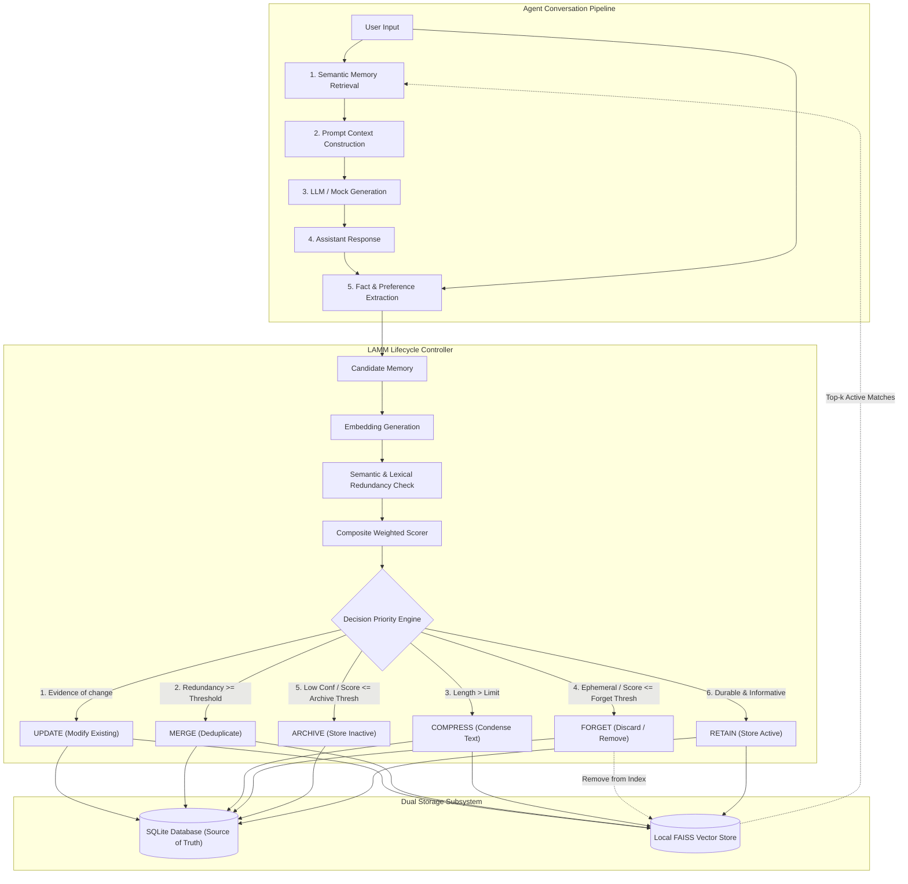

# LAMM Architectural Specification

## 1. Executive Overview

**LAMM (Lightweight Adaptive Memory Management)** is an external, training-free memory lifecycle layer for long-term Large Language Model (LLM) agents. It addresses the unbounded growth, semantic redundancy, and outdated knowledge challenges of persistent conversational agents without requiring model fine-tuning or proprietary vector databases.

---

## 2. Core Architectural Design Principles

### Principle 1: LLM Independence
LAMM operates completely outside the LLM. The LLM is invoked only for conversational generation and (optionally) natural-language extraction. The core decision logic (scoring, thresholding, deduplication, conflict detection, and lifecycle management) is implemented purely in deterministic Python.

### Principle 2: Separation of Operations vs. Decision Priority
- **Lifecycle Operations Vocabulary:** The conceptual lifecycle operations are documented in their natural lifecycle progression:
  $$\text{Retain} \rightarrow \text{Update} \rightarrow \text{Merge} \rightarrow \text{Compress} \rightarrow \text{Archive} \rightarrow \text{Forget}$$
- **Decision Priority Engine:** To ensure semantic integrity, relational decisions (modifications, deduplication, verbosity) are evaluated *before* score-based eviction:
  $$\text{Update} \rightarrow \text{Merge} \rightarrow \text{Compress} \rightarrow \text{Forget} \rightarrow \text{Archive} \rightarrow \text{Retain}$$
  *Invariant:* A low composite score will never inadvertently discard an incoming fact that is an explicit `UPDATE` to an existing memory.

### Principle 3: SQLite as the Canonical Source of Truth
- **SQLite:** Stores canonical text, full lifecycle state, access counts, creation/update timestamps, score breakdowns, and immutable audit logs.
- **FAISS:** A derived index containing normalized embeddings of **only active** retrievable memories.
- When memories are forgotten or archived, they are immediately unindexed from FAISS.

### Principle 4: In-Place Representation for COMPRESS
Compression does not create a duplicate memory record. It replaces the active retrievable representation of the existing record, updates its embedding vector in FAISS, and preserves the uncompressed text in SQLite for auditing and reproducibility.

---

## 3. Subsystem Breakdown

### 3.1 Conversational Agent Layer (`app/agent/`)
- `LammAgent`: Coordinates message ingestion, retrieval, prompt assembly, generation, extraction, and lifecycle governance.
- `ContextBuilder`: Constructs prompt context combining retrieved memories and recent turns, computing provider-aware token metrics.
- `MockLLMClient` & `GeminiAdapter`: Seamless dual-mode execution (100% offline deterministic vs. cloud Gemini API).

### 3.2 Memory Lifecycle Controller (`app/memory/`)
- `LammLifecycleController`: Implements the 6-stage decision priority engine.
- `WeightedScorer`: Evaluates composite scores over relevance, recency, confidence, redundancy, and utility.
- `MemoryExtractor`: Extracts key entities and facts from user/assistant turns with deterministic offline fallback.
- `MemoryCompressor`: Sentence-boundary truncation and clause-level merging.
- `Deduplication`: Evidence-based update detection and lexical Jaccard similarity.

### 3.3 Storage & Retrieval Layer (`app/storage/` & `app/retrieval/`)
- `Database`: SQLite connection with foreign keys, WAL mode, thread safety (`check_same_thread=False`), and automatic column migration.
- `MemoryRepository`: CRUD operations and least-recently-used (LRU) lookups.
- `LifecycleEventRepository`: Immutable audit trail recording before-state, after-state, scores, and reason.
- `FaissVectorStore`: Local Inner-Product (cosine on normalized vectors) index with ID-mapping and vector removal.

### 3.4 API & UI Layer (`app/api/` & `dashboard/`)
- **FastAPI Backend:** 11 RESTful endpoints for chat, memory management, vector search, index synchronization, and evaluation.
- **Streamlit Dashboard:** 4 interactive pages (Live Chat, Memory Inspector, Analytics, 3-Way Benchmark Comparison).

---

## 4. Latency and Token Accounting

LAMM provides fine-grained performance accounting across the agent pipeline:
- **Retrieval Latency:** Vector search time in FAISS.
- **Generation Latency:** LLM inference time.
- **Extraction Latency:** Candidate memory extraction time.
- **Management Latency:** Scoring, deduplication, and SQLite/FAISS update time.
- **Token Accounting:** Exact tokenizer-based token calculation when Gemini is active; documented heuristic estimation in offline mock mode.
