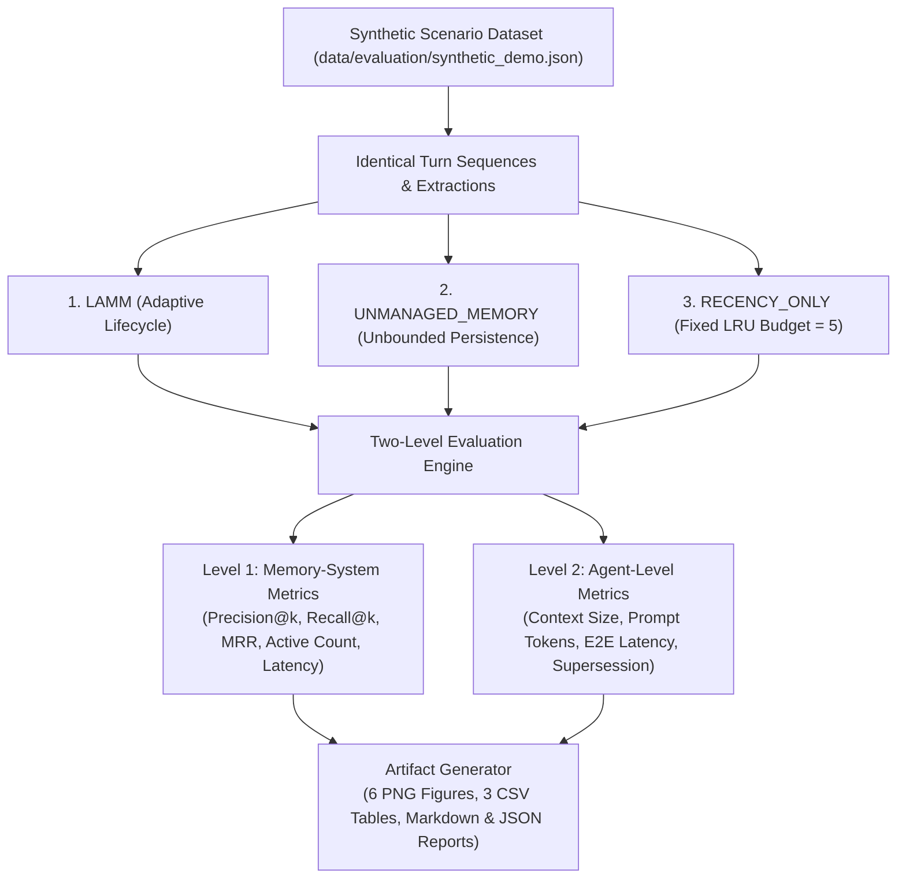

# LAMM Research Evaluation Framework

## 1. Experimental Methodology

The evaluation framework assesses whether LAMM's adaptive memory lifecycle provides superior memory retention efficiency, retrieval accuracy, and prompt token savings compared to standard memory handling baselines.



---

## 2. Compared Systems & Fair Evaluation Guarantee

To ensure strict scientific fairness, all three systems receive:
- The exact same conversation turn order
- The exact same candidate memory extractions
- The exact same evaluation queries and order
- The exact same embedding provider (`deterministic-hash`, 384 dimensions)
- The exact same top-$k$ retrieval parameter ($k=5$)

### Systems Under Evaluation:
1. **LAMM (Proposed):**  
   Dynamically manages memory using multi-factor scoring and the 6 lifecycle operations (*Retain*, *Update*, *Merge*, *Compress*, *Archive*, *Forget*).
2. **UNMANAGED_MEMORY (Baseline 1):**  
   Stores every extracted memory candidate without eviction, deduplication, or capacity limits (models uncontrolled growth).
3. **RECENCY_ONLY (Baseline 2 - LRU):**  
   Enforces a fixed active memory budget (default $N=5$) by evicting the least-recently-accessed memory purely based on timestamp, ignoring semantic relevance, confidence, and redundancy.

---

## 3. Two-Level Metric Definitions

### Level 1: Memory-System Level Metrics

- **Active Memory Reduction (%):**
  $$\text{Memory Reduction (\%)} = \frac{N_{\text{active}}^{\text{Baseline}} - N_{\text{active}}^{\text{LAMM}}}{N_{\text{active}}^{\text{Baseline}}} \times 100$$
- **Precision@k:**
  $$\text{Precision@k} = \frac{|\mathcal{R}_{\text{retrieved}} \cap \mathcal{R}_{\text{relevant}}|}{\min(k, |\mathcal{R}_{\text{retrieved}}|)}$$
- **Recall@k:**
  $$\text{Recall@k} = \frac{|\mathcal{R}_{\text{retrieved}} \cap \mathcal{R}_{\text{relevant}}|}{|\mathcal{R}_{\text{relevant}}|}$$
- **Mean Reciprocal Rank (MRR):**
  $$\text{MRR} = \frac{1}{|Q|} \sum_{i=1}^{|Q|} \frac{1}{\text{rank}_i}$$
- **Semantic Retrieval Latency:** Wall-clock time (in milliseconds) to perform vector similarity lookup.

> **Strict Ground-Truth Rule:** Precision@k, Recall@k, and MRR are computed **only** for queries with explicit ground-truth topical annotations in `synthetic_demo.json`. Unannotated exploratory queries are excluded from accuracy calculations.

### Level 2: Agent Level Metrics

- **Context Token Reduction (%):**
  $$\text{Token Reduction (\%)} = \frac{\bar{T}_{\text{tokens}}^{\text{Baseline}} - \bar{T}_{\text{tokens}}^{\text{LAMM}}}{\bar{T}_{\text{tokens}}^{\text{Baseline}}} \times 100$$
- **End-to-End Latency:** Complete turnaround time including retrieval, context construction, response generation, and lifecycle management.
- **Knowledge Supersession Accuracy:** Verifies whether the agent context contains the updated fact (e.g., *Java*) rather than contradictory outdated facts (*Python*).

---

## 4. Running Experiments & Generated Artifacts

Execute the evaluation harness via CLI:
```powershell
.\lammenv\Scripts\python.exe scripts\run_evaluation.py
```

### Generated Output Files:

| File Path | Description |
| :--- | :--- |
| `results/tables/memory_growth.csv` | Turn-by-turn memory counts, context token consumption, and latency. |
| `results/tables/retrieval.csv` | Query-by-query retrieval latency, precision@k, recall@k, and MRR. |
| `results/tables/metrics_summary.csv` | Final aggregate summary table comparing all three systems. |
| `results/figures/memory_growth.png` | Total stored memory growth curves over conversation turns. |
| `results/figures/active_memory_count.png` | Active retrievable memory counts showing LAMM and LRU bounds. |
| `results/figures/token_context_consumption.png` | Context token load across conversation turns. |
| `results/figures/retrieval_latency.png` | Box plots of semantic vector retrieval latency across systems. |
| `results/figures/lifecycle_operations.png` | Bar chart of LAMM lifecycle operation counts. |
| `results/figures/retrieval_quality.png` | Bar chart of Precision@k, Recall@k, and MRR on ground-truth queries. |
| `results/reports/evaluation_report.json` | Complete machine-readable results payload with configuration snapshot. |
| `results/reports/evaluation_report.md` | Formatted academic research evaluation report. |
